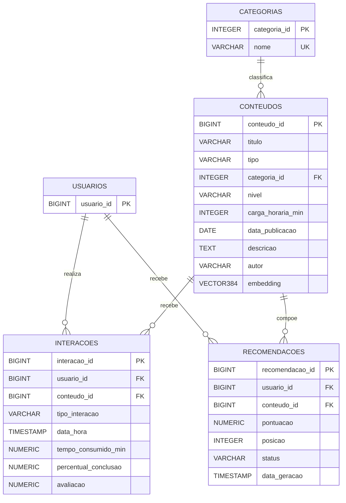

# Modelo Lógico e Relacional do Banco de Dados

## 1. Visão geral

O projeto utiliza PostgreSQL para os dados estruturados e MongoDB para comentários e avaliações textuais semiestruturadas.

No PostgreSQL, o modelo é composto por cinco entidades principais:

- `usuarios`
- `categorias`
- `conteudos`
- `interacoes`
- `recomendacoes`

As views utilizadas no dashboard do Apache Superset são estruturas derivadas para análise e não são tratadas como entidades do modelo lógico.

---

## 2. Modelo lógico

### Relacionamentos e cardinalidades

- Uma categoria classifica vários conteúdos: `CATEGORIAS 1:N CONTEUDOS`.
- Um usuário realiza várias interações: `USUARIOS 1:N INTERACOES`.
- Um conteúdo pode receber várias interações: `CONTEUDOS 1:N INTERACOES`.
- Um usuário pode receber várias recomendações: `USUARIOS 1:N RECOMENDACOES`.
- Um conteúdo pode aparecer em várias recomendações: `CONTEUDOS 1:N RECOMENDACOES`.



---

## 3. Modelo relacional

### USUARIOS

```text
USUARIOS (
    usuario_id BIGINT PK
)
```

Representa os usuários da plataforma.

### CATEGORIAS

```text
CATEGORIAS (
    categoria_id SERIAL PK,
    nome VARCHAR(120) UNIQUE NOT NULL
)
```

Representa as categorias temáticas utilizadas para classificar os conteúdos.

### CONTEUDOS

```text
CONTEUDOS (
    conteudo_id BIGINT PK,
    titulo VARCHAR(255) NOT NULL,
    tipo VARCHAR(30) NOT NULL,
    categoria_id INTEGER FK NOT NULL,
    nivel VARCHAR(30) NOT NULL,
    carga_horaria_min INTEGER NOT NULL,
    data_publicacao DATE NOT NULL,
    descricao TEXT NOT NULL,
    autor VARCHAR(180) NOT NULL,
    embedding VECTOR(384)
)

FK categoria_id -> CATEGORIAS(categoria_id)
```

O campo `embedding vector(384)` armazena a representação vetorial dos conteúdos utilizada pelo `pgvector` para busca semântica e apoio ao motor de recomendação.

### INTERACOES

```text
INTERACOES (
    interacao_id BIGINT PK,
    usuario_id BIGINT FK NOT NULL,
    conteudo_id BIGINT FK NOT NULL,
    tipo_interacao VARCHAR(30) NOT NULL,
    data_hora TIMESTAMP NOT NULL,
    tempo_consumido_min NUMERIC(10,2) NOT NULL,
    percentual_conclusao NUMERIC(5,2) NOT NULL,
    avaliacao NUMERIC(2,1)
)

FK usuario_id -> USUARIOS(usuario_id)
FK conteudo_id -> CONTEUDOS(conteudo_id)
```

A tabela registra o comportamento dos usuários sobre os conteúdos, incluindo visualizações, início, conclusão, curtida, avaliação e compartilhamento.

### RECOMENDACOES

```text
RECOMENDACOES (
    recomendacao_id BIGSERIAL PK,
    usuario_id BIGINT FK NOT NULL,
    conteudo_id BIGINT FK NOT NULL,
    pontuacao NUMERIC(6,2) NOT NULL,
    posicao INTEGER NOT NULL,
    status VARCHAR(20),
    data_geracao TIMESTAMP NOT NULL,
    UNIQUE(usuario_id, conteudo_id, data_geracao)
)

FK usuario_id -> USUARIOS(usuario_id)
FK conteudo_id -> CONTEUDOS(conteudo_id)
```

A tabela armazena o resultado do motor de recomendação, preservando a pontuação, posição, status e data de geração.

---

## 4. Regras de integridade

O modelo aplica as seguintes regras principais:

- `conteudos.tipo`: apenas `Curso`, `Vídeo`, `Artigo` ou `Podcast`;
- `conteudos.nivel`: apenas `Básico`, `Intermediário` ou `Avançado`;
- `carga_horaria_min > 0`;
- `tempo_consumido_min >= 0`;
- `percentual_conclusao` entre `0` e `100`;
- `avaliacao` entre `1` e `5`, quando informada;
- `pontuacao` da recomendação entre `0` e `100`;
- `posicao` da recomendação maior que `0`;
- integridade referencial por chaves estrangeiras;
- unicidade da combinação `(usuario_id, conteudo_id, data_geracao)` em recomendações.

---

## 5. Views utilizadas para métricas e dashboard

As seguintes views são utilizadas para disponibilizar dados ao Apache Superset:

- `vw_content_views_by_category`
- `vw_content_completion_by_category`
- `vw_recommendation_conversion`

Essas views não representam novas entidades de negócio; elas derivam dados das tabelas relacionais para facilitar o cálculo de métricas e KPIs.

---

## 6. MongoDB e dados semiestruturados

Comentários e avaliações textuais são persistidos no MongoDB por apresentarem estrutura semiestruturada, com campos como texto livre e listas de tags.

Estrutura lógica aproximada do documento:

```text
COMENTARIOS (
    comentario_id,
    usuario_id,
    conteudo_id,
    comentario,
    avaliacao,
    data,
    tags,
    categoria
)
```

Os campos `usuario_id` e `conteudo_id` mantêm a associação lógica com as entidades do PostgreSQL, mas não são chaves estrangeiras físicas no MongoDB.

---

## 7. Justificativa do modelo

O modelo relacional separa entidades de domínio, eventos de interação e resultados de recomendação, reduzindo redundância e garantindo integridade referencial. O PostgreSQL é utilizado para dados estruturados e para vetores com `pgvector`, enquanto o MongoDB é empregado nos comentários e avaliações textuais por sua flexibilidade para dados semiestruturados. Essa separação permite combinar consistência relacional, busca vetorial e análise de dados no Apache Superset.
